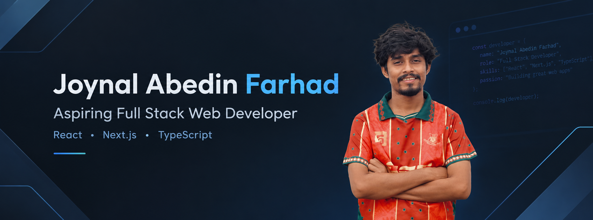

# Hi 👋, I'm Joynal Abedin Farhad
---

  

 Building modern web applications through hands-on projects and continuous learning. 

## 👨‍💻 About Me

- - 🔭 Currently working on **[Final Practice Better Auth](https://github.com/farhadcodesstack/final-practice-better-auth)** — a Next.js project where I’m practicing authentication and full-stack development
- 🌱 Currently learning **Next.js, TypeScript, Authentication, MongoDB, and modern full-stack development**
- 👯 Open to collaborating on **open-source and full-stack web development projects**
- 💬 Ask me about **JavaScript, TypeScript, React, Next.js, Git & GitHub**
- 🎯 Goal: Become a skilled **AI-Driven Full-Stack Developer** and build real-world applications
- 📫 Email: **[speedfarhad@gmail.com](mailto:speedfarhad@gmail.com)**
- ⚡ Fun fact: **I enjoy turning ideas into web applications and debugging things until they finally work! 😄** 
---

## 🛠️ Tech Stack

### **Frontend**

### **Database**

### **Authentication**

### **Programming & Concepts**

### **Design Tools**

### **Development Tools**

---

## 🚀 Featured Projects

### 🏋️ Fit Log

A modern workout and fitness application for planning workouts, saving routines, tracking completed exercises, and monitoring workout metrics.

**Tech:** Next.js · TypeScript · React · Tailwind CSS · Context API

[📂 GitHub Repository](https://github.com/farhadcodesstack/Fit-log-Project-6)

---

### 🧑‍💻 Dev Stack

A development technology stack application built with React and TypeScript.

**Tech:** React · TypeScript · Tailwind CSS · Vite

[📂 GitHub Repository](https://github.com/farhadcodesstack/Dev-Stack-project-React-5)

---

### 🏏 BPL Dream

A React-based cricket project built with TypeScript and Vite.

**Tech:** React · TypeScript · Vite

[📂 GitHub Repository](https://github.com/farhadcodesstack/Bpl-dream-project)

## 🌐 Connect With Me

---
## 📊 GitHub Stats

---

👀 Profile Views

---

## 🔥 GitHub Streak

